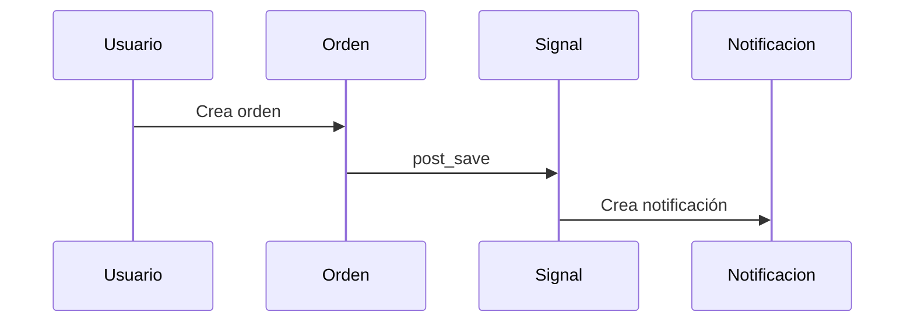

# 🛍️ Tiendita de Marian
Tiendita de Marian es una tienda en línea construida con Django + Django REST Framework. Ofrece una API robusta, segura y modular para la gestión de productos, usuarios y compras. Incluye autenticación JWT, carrito persistente, checkout, historial de órdenes, notificaciones por email, documentación OpenAPI decorada sin warnings, y pruebas automáticas por dominio.

##📦 Tech Stack
Componente	          |Tecnología / Herramienta
----------------------|-------------------------------------------
🧠 Backend	         |Django 5 + Django REST Framework
🔐 Autenticación	    |JWT (djangorestframework-simplejwt)
📘 Documentación	    |Swagger/OpenAPI (drf-spectacular)
🔒 Seguridad	        |.env con django-environ
🧪 Testing	         |TestCase por módulo + settings_test.py
🗄️ Base de datos	      |  SQLite (dev) / MySQL o PostgreSQL (producción)
🧸 Carga masiva	      |Management commands + CSV + imágenes
🧠 Auditoría	        |Signals + AuditLog con UUID y JSONField
🚀 Despliegue	        |pythonanywhere

##⚙️ Instalación
```bash
git clone https://github.com/tuusuario/tiendita-marian.git
cd tiendita-marian
python -m venv env
source env/bin/activate  # en Windows: env\Scripts\activate
pip install -r requirements.txt
```
##🔐 Configuración
Crea un archivo .env en la raíz del proyecto:
```
SECRET_KEY='tu_clave_segura'
DEBUG=True
EMAIL_HOST_USER='tu_correo@gmail.com'
EMAIL_HOST_PASSWORD='tu_contraseña_app'
```

##🧩 Migraciones y ejecución
```bash
python manage.py makemigrations
python manage.py migrate
python manage.py runserver
```
##🔐 Autenticación JWT + Registro
Endpoints disponibles:

- POST /api/auth/register/ → Registra un nuevo usuario y devuelve el token automáticamente

- POST /api/auth/token/ → Autentica y devuelve el token JWT

- POST /api/auth/token/refresh/ → Refresca el token

Validaciones incluidas:

- Email único

- Contraseñas coincidentes

- Longitud mínima

Ejemplo de respuesta:
```
json
{
  "message": "Usuario creado exitosamente",
  "usuario": {
    "username": "nicolas",
    "email": "nicolas@example.com"
  },
  "token": {
    "access": "eyJ0eXAiOiJKV1QiLCJh...",
    "refresh": "eyJ0eXAiOiJKV1QiLCJh..."
  }
}
```
##🛠️ Features
CRUD de productos con paginación y filtros

Carrito persistente por usuario

Checkout y creación de órdenes

Historial de órdenes paginado y filtrable

Detalle de orden específica

Endpoints protegidos con JWT

Webhook: email automático al crear orden

Documentación Swagger decorada por dominio

Pruebas automáticas por módulo

Backend modular, desacoplado y listo para producción

Admin interface habilitada

##🧱 Estructura del proyecto
```bash
tiendita-backend-django/
├── config/                  # Configuración global
│   ├── settings.py          # Config principal
│   ├── settings_test.py     # Config para testing CI/CD
│   ├── urls.py              # URLs globales
│   ├── checklist.md         # Tareas técnicas
│   └── README_SETTING.md    # Documentación técnica
│
├── apps/                    # Apps por dominio
│   ├── productos/           # CRUD + carga masiva
│   ├── carrito/             # Lógica de carrito
│   ├── orden/               # Órdenes + señales
│   ├── auth_api/            # Registro + JWT
│   ├── auditlog/            # Auditoría automática
│   └── ...                  # Otros módulos
│
├── staticfiles/             # Archivos estáticos
├── media/                   # Imágenes subidas
│   └── productos/images/    # Imágenes de productos
├── manage.py
├── requirements.txt
├── .env
├── .gitignore
└── README.md
```
##🧪 Pruebas
```bash
python manage.py test
```
## 📜 Documentación Swagger
```bash
python manage.py generate_swagger
```
Disponible en /api/docs/ con:

Agrupación por tags

Ejemplos y respuestas

Nombres semánticos (operation_id)

Decoración visual sin warnings
```
🪝 Git Hooks personalizados
```
Este proyecto incluye hooks versionables para automatizar tareas:

post-checkout: selecciona automáticamente el entorno .env según la rama (main o dev)

Ubicados en .githooks/ y activados con:

```bash
git config core.hooksPath .githooks
```
## 🧪 Entorno de Testing para CI/CD
Archivo dedicado: config/settings_test.py

✅ SQLite en memoria

✅ Backend de correo local (locmem)

✅ Hashing MD5 para contraseñas

✅ Sin dependencia de .env

✅ Compatible con GitHub Actions y multiplataforma

```markdown

```
##🧠 Auditoría automática de eventos
Registra automáticamente cada creación, actualización y eliminación en la tabla AuditLog.

Compatible con ImageField, DateTimeField, ForeignKey

Serialización robusta con JSONField

Señales desacopladas (post_save, post_delete)

Compatible con UUIDs y claves alfanuméricas

Documentado y testeado con cobertura total

##🧸 Product Loader: Enabled
Carga masiva de productos con imágenes desde CSV.

✅ Configuración correcta de MEDIA_ROOT y MEDIA_URL

⚙️ Comando load_products con validación de rutas

🧪 Fixture para testing desacoplado

🧹 Limpieza de carpetas erróneas y duplicadas

##🔔 Signal Flow: Orden → Notificación

##🧑‍💻 Autor
Nicolás Andrés Cano Leal Backend Developer especializado en APIs robustas con Django REST Framework, FastAPI y Flask.

>>“Una tienda simple hecha con principios sólidos: escalabilidad, seguridad y código limpio.”

🌐 nicolasandres.pythonanywhere.com

🐙 github.com/nicolasandrescl

💼 linkedin.com/in/nicolas-andres-cano-leal

📧 nicolas.cano.leal@gmail.com

